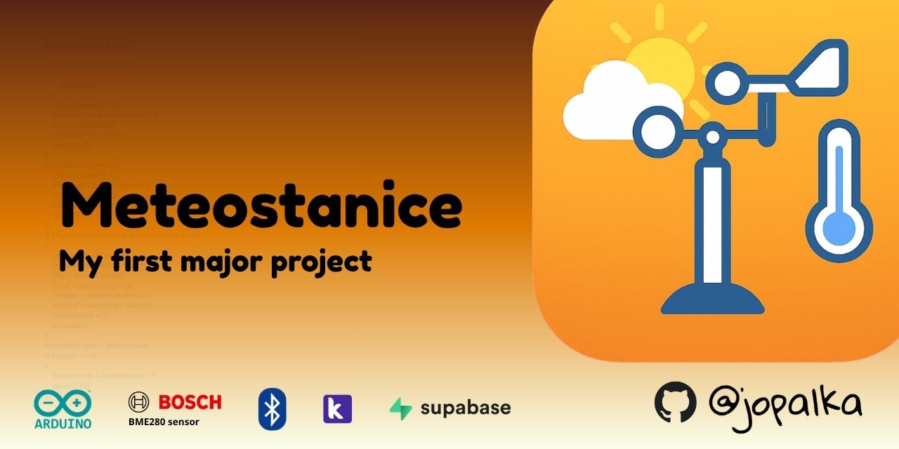
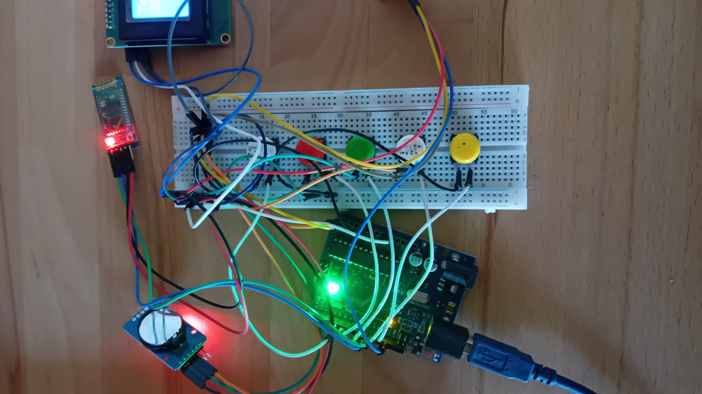
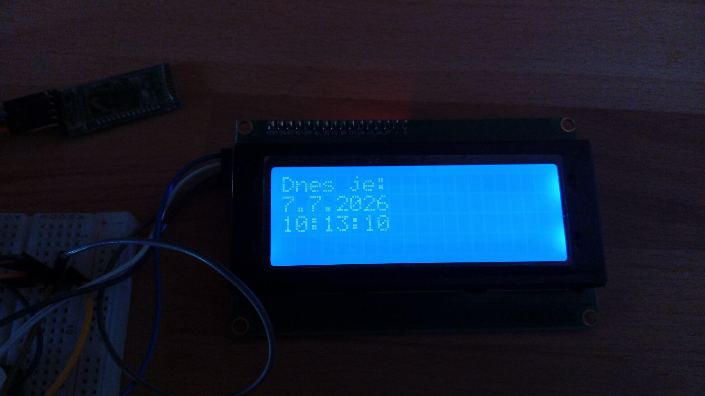
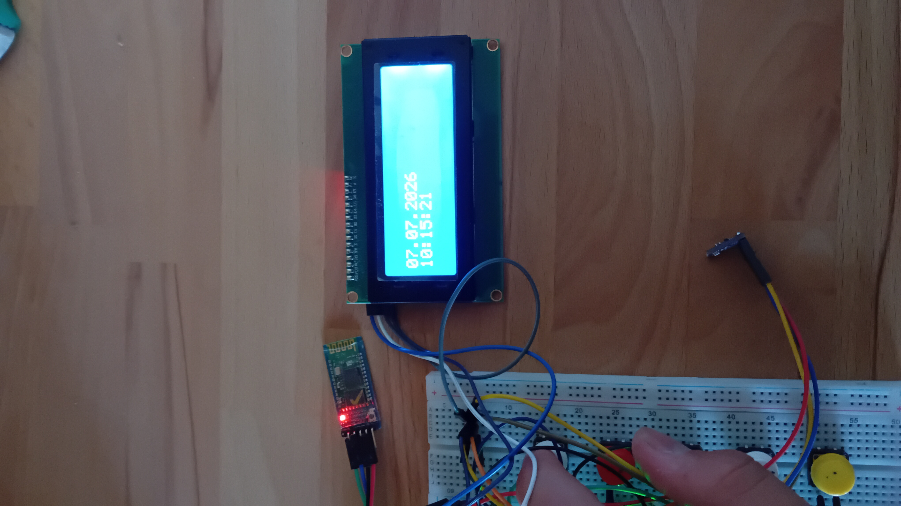
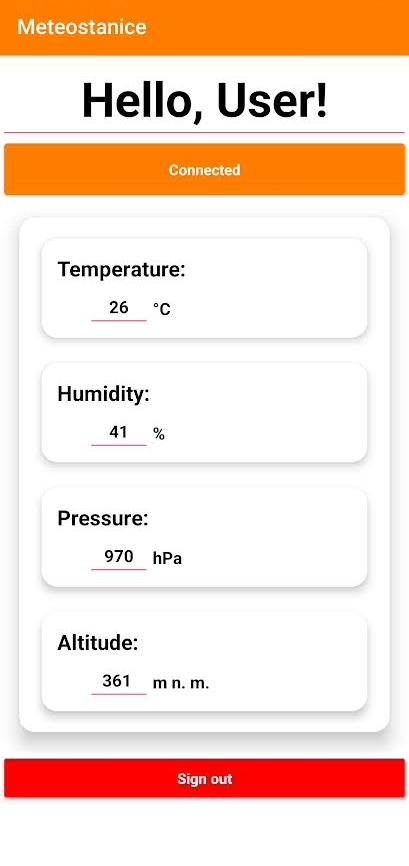
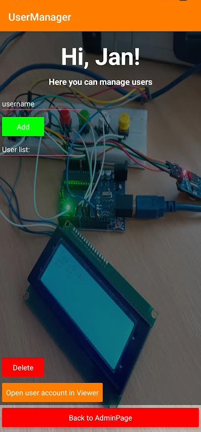

# Meteostanice⛅
My first major project

  

### Description
#### **"Meteostanice"** is my first major project. It measures real-time weather data and sends it to my own Kodular app. It is based on Arduino, a BME280 sensor, a Bluetooth module, an RTC module for showing time, and an I2C LCD display.
---
### Technologies

*Hardware control, weather station logic, and reading values from the sensor.*

*Programming language for Arduino.*

*Platform for programming my app.*

*Database for uploading users' info(username, hashed password by SHA-256, email for communication and sending new versions of app, and full name).*

*Smart and easy way to send data from Arduino to Kodular app and back.*

*Great sensor which measures temperature, humidity and pressure.*

---

### Features
#### Part 1: Arduino
* Measuring temperature
* Measuring humidity
* Measuring pressure
* Calculating altitude
* Displaying real-time based on an RTC module
* Displaying data on the LCD display with I2C
* Sending data to my own Kodular app
#### ----------------------------------
#### Part 2: Kodular app
* Receiving data from Arduino via Bluetooth
* Displaying data in CardView
* User authentication with username and password
* Hashing password by SHA-256
* Cloud database powered by Supabase
* Admin mode
#### ----------------------------------
#### Part 3: 3D case for weather-station
##### *Still in progress*.
---
###  Hardware
* Arduino
* Bosch BME280 sensor
* LCD display with I2C
* BT HC-05 module
* RTC module
* Buttons for controlling the LCD display
---
### Photos

  
<b>Hardware Photos<b>

  
  

    
    
    
  

  
<b>App Screenshots<b>

  

    
    
    
    
    
  

---
### Future ideas for version 2.0:
- [ ] Displaying history of weather data in charts

- [ ] Replacing Arduino Uno by Arduino Nano
---
## License
#### MIT License
---
### Author
##### Jan Opálka
###### GitHub: @jopalka
