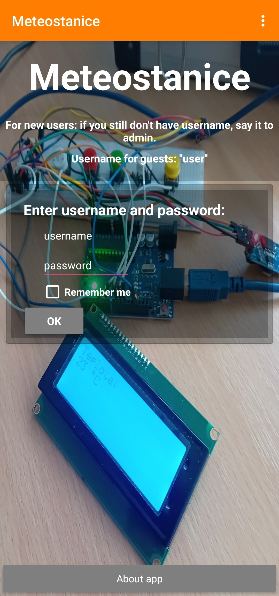
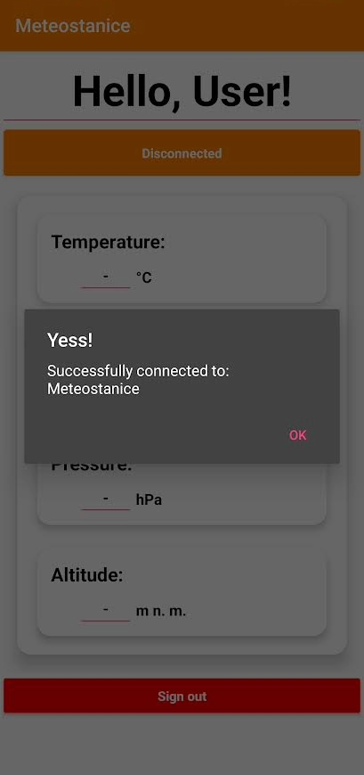
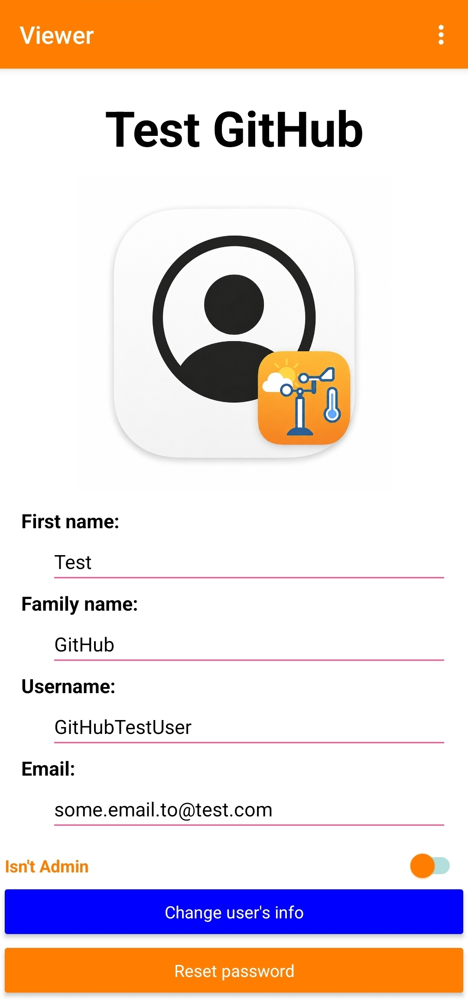

# Meteostanice⛅
My first major project

### Description
**"Meteostanice"** is my first major project. It measures real-time weather data and sends it to my own Kodular app. It is based on Arduino, a BME280 sensor, a Bluetooth module, an RTC module for showing time, and an I2C LCD display.
#### -------------------------------------------------------------------
### Features
#### Part 1: Arduino
##### Measuring temperature
##### Measuring humidity
##### Measuring pressure
##### Calculating altitude
##### Displaying real-time based on an RTC module
##### Displaying data on the LCD display with I2C
##### Sending data to my own Kodular app
#### ----------------------------------
#### Part 2: Kodular app
##### Receiving data from Arduino via Bluetooth
##### Displaying data in CardView
##### User authentication with username and password
##### Hashing password by SHA-256
##### Cloud database powered by Supabase
##### Admin mode
#### ----------------------------------
#### Part 3: 3D case for weather-station
##### *Still in progress*.
#### -------------------------------------------------------------------
###  Hardware
##### Arduino
##### Bosch BME280 sensor
##### LCD display with I2C
##### BT HC-05 module
##### RTC module
##### Buttons for controlling the LCD display
#### -------------------------------------------------------------------
### Photos
#### Hardware Photos

##### *Main hardware setup(I will add 3D case for it...)*

##### *LCD display - main screen(showing real-time)*

##### *chantim(CHANging TIMe) in progress)*
#### ----------------------------------
#### App Screenshots

##### *Main screen*

##### *Afterpasswordentering - my name for screen, which is coming AFTER PASSWORD ENTERING in Main Screen*

##### *Displaying notifier with message of successful connection to HC-05.*

##### *Displaying testing profile in Viewer - my screen for displaying selected user*

##### *Screenshot of UserManager - screen, which is supposed for adding new users*
#### -------------------------------------------------------------------
### Author
##### Jan Opálka
###### GitHub: @jopalka
